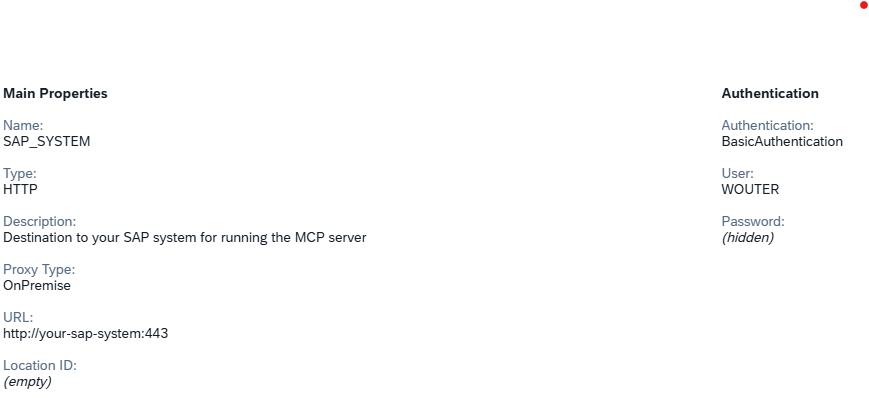

# Deployment Guide

## Prerequisites

1. SAP BTP Global Account with CloudFoundry environment
2. Cloud Foundry CLI installed and configured
3. MBT (Multi-Target Application Archive Builder) installed
4. Access to on-premise SAP system
5. SAP Cloud Connector configured (for on-premise connectivity)

## Step-by-Step Deployment

### 1. Prepare BTP Environment

```bash
# Login to Cloud Foundry
cf login -a https://api.cf.{region}.hana.ondemand.com

# Target your org and space
cf target -o your-org -s your-space
```

### 2. Configure Destination in BTP

You must create a destination in SAP BTP to connect to your on-premise SAP system. This destination should use **Basic Authentication** and the **virtual hostname** configured in SAP Cloud Connector as the URL.

#### Option 1: Use the default destination name

- Create a destination in BTP with the name `SAP_SYSTEM`.

#### Option 2: Use a custom destination name

- Create a destination in BTP with a name of your choice.
- Set the environment variable `SAP_DESTINATION_NAME` to your chosen destination name when deploying the application.

#### Example Destination Configuration

- **Name:** SAP_SYSTEM (or your custom name)
- **Type:** HTTP
- **Authentication:** BasicAuthentication
- **Proxy Type:** OnPremise
- **User:** [your_sap_username]
- **Password:** [your_sap_password]
- **URL:** https://[virtual-hostname]:[port] (as configured in SAP Cloud Connector)



For more details on creating destinations, see the [SAP BTP documentation](https://help.sap.com/docs/btp/sap-business-technology-platform/creating-destinations).

### 3. Build the Application

Use the following npm script to build the application and generate the MTAR archive:

```bash
npm run build:btp
```

This will compile the project and create the MTAR file in the `mta_archives` directory.

### 4. Deploy the Application

Use the following npm script to deploy the MTAR archive to SAP BTP:

```bash
npm run deploy:btp
```

This will upload and deploy the application to your Cloud Foundry space.